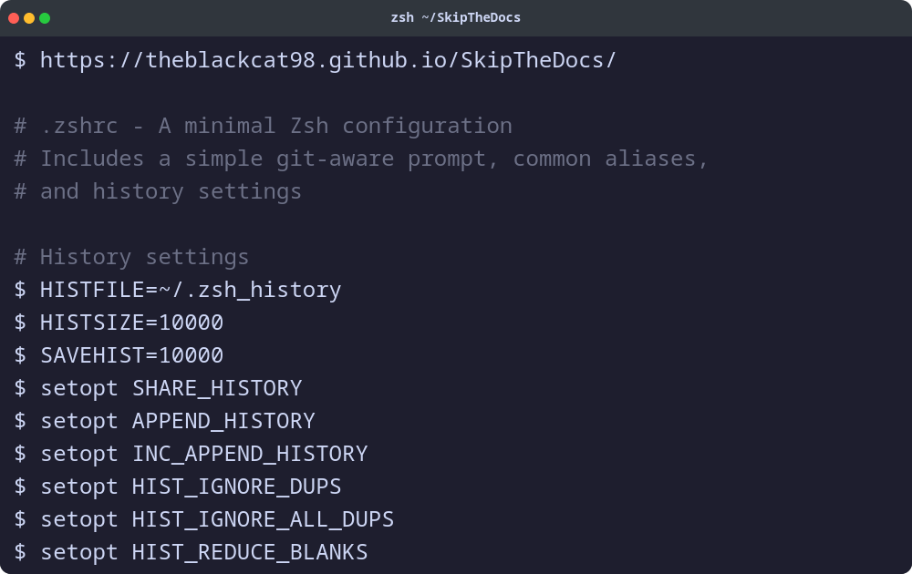

<div align="center">


</div>

# SkipTheDocs

A static website designed for discovering and sharing configuration templates for command-line tools.

https://theblackcat98.github.io/SkipTheDocs/

## Core Functionality

SkipTheDocs provides the following features:

*   **Configuration Discovery:** Displays a curated list of configuration files.
*   **Search & Filter:** Allows users to efficiently search and filter configurations by tool name, filename, or description.
*   **Content Viewer:** Provides a modal interface to view the raw content of any configuration file.
*   **Download Option:** Enables users to download configuration files directly.

Future planned feature: CLI TOOL

<div align="center">


<!--  -->

</div>

## Project Structure

*   [`App.tsx`](App.tsx): The main React component responsible for managing the application's global state and rendering the primary user interface.
*   [`index.tsx`](index.tsx): The entry point of the React application, where the root component is rendered into the DOM.
*   [`components/`](components/): A directory containing various reusable React components such as `Header`, `SearchBar`, `ConfigCard`, and `Modal`, which are used throughout the application.
*   [`data/configs/`](data/configs/): This directory stores the actual configuration files that are displayed and downloaded by the application.
*   [`constants.tsx`](constants.tsx): Contains application-wide constants, including a predefined list of popular tools used for filtering and categorization.
*   [`CONTRIBUTING.md`](CONTRIBUTING.md): Provides guidelines for contributors.

## How to Add New Configurations

To add a new configuration file to SkipTheDocs, simply add the file to the `data/configs` directory. The application will automatically detect the new file and load it.

Each configuration file **must** contain a YAML front matter block at the top with the following metadata:

```yaml
---
toolName: "Name of the Tool"
author: "Author's Name"
description: "A brief description of the configuration."
version: "1.0.0"
repositoryUrl: "https://github.com/user/repo"
---
```

SkipTheDocs will parse this metadata to display the configuration in the UI.

## Contributing

We welcome contributions to SkipTheDocs! If you're interested in helping, please review our [contributing guidelines](CONTRIBUTING.md) to get started.
